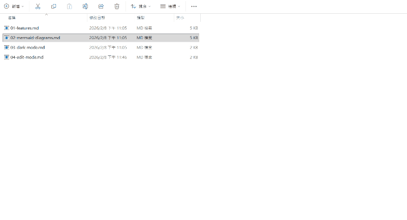
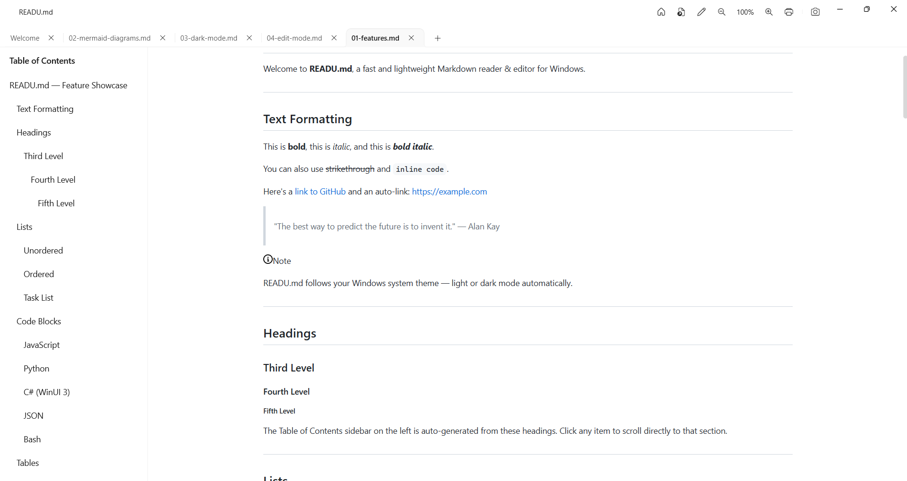
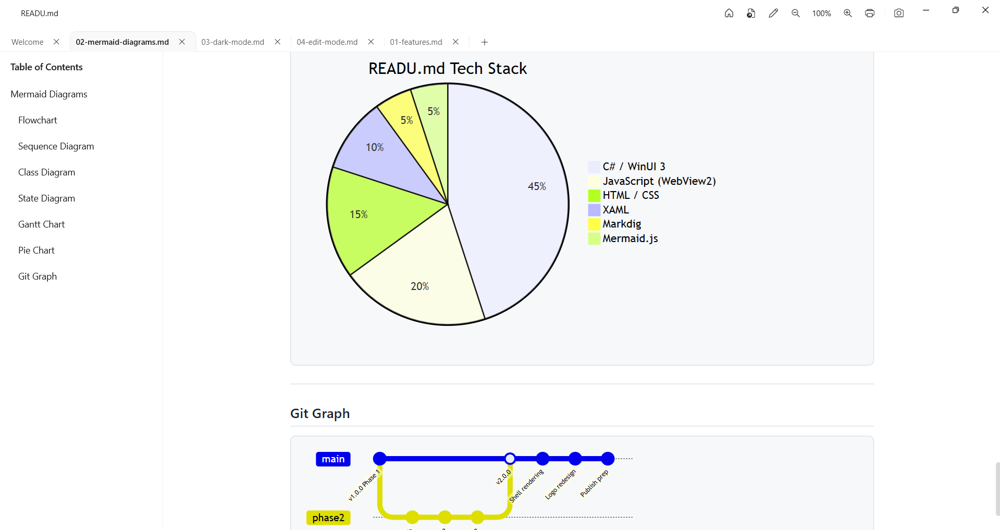
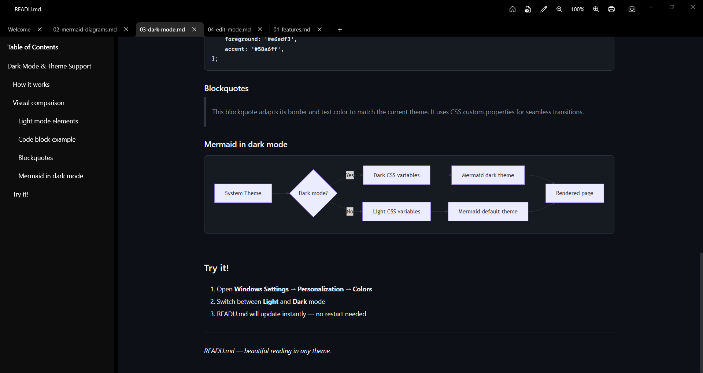
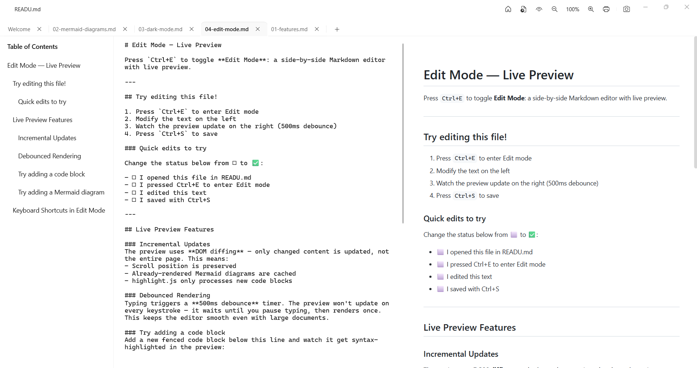

# READU.md

A fast, lightweight Markdown reader & editor for Windows, built with **Fluent Design**.


[](https://github.com/breezy89757/READU.md/releases/latest)

<p align="center">
  
</p>

> **[⬇️ Download Latest Release](https://github.com/breezy89757/READU.md/releases/latest)** — Extract & run, no installation needed.

## Screenshots

| Features & TOC | Mermaid Diagrams |
|:---:|:---:|
|  |  |

| Dark Mode | Edit Mode (Split View) |
|:---:|:---:|
|  |  |

## Features

- **Multi-Tab** — open multiple files simultaneously, with drag-to-reorder tabs
- **Edit Mode** — side-by-side Markdown editor + live preview (`Ctrl+E`)
- **Instant Rendering** — powered by WebView2 (Chromium) and Markdig
- **Syntax Highlighting** — code blocks highlighted via highlight.js
- **Mermaid.js** — flowcharts, sequence diagrams, Gantt charts, and more
- **Smart Mermaid Caching** — SHA256-based incremental DOM updates preserve rendered diagrams
- **Dark Mode** — automatically follows your Windows system theme
- **Table of Contents** — auto-generated sidebar with smooth scroll navigation
- **Drag & Drop** — drop any `.md` file to open it instantly
- **Hot Reload** — automatically refreshes when the file changes externally
- **Scroll & Zoom Persistence** — per-tab scroll position and zoom level preserved across tab switches
- **Print / PDF Export** — `Ctrl+P` to print or save as PDF
- **Full Page Screenshot** — capture the entire rendered page as PNG (`Ctrl+Shift+S`)
- **File Association** — double-click `.md` files to open in READU.md
- **Lightweight** — minimal memory footprint, instant startup with pre-loaded CDN shell

## Keyboard Shortcuts

| Shortcut | Action |
|---|---|
| `Ctrl+O` | Open file (new tab) |
| `Ctrl+W` | Close current tab |
| `Ctrl+Tab` | Next tab |
| `Ctrl+Shift+Tab` | Previous tab |
| `Ctrl+E` | Toggle Edit / Read mode |
| `Ctrl+S` | Save file (edit mode) |
| `Ctrl+N` | New blank tab (edit mode) |
| `Ctrl+P` | Print / Export PDF |
| `Ctrl+Shift+S` | Full page screenshot |
| `Ctrl+` `+` / `-` | Zoom in / out |
| `Ctrl+0` | Reset zoom to 100% |
| `Ctrl+Home` | Open Welcome page |

## Tech Stack

| Component | Technology |
|---|---|
| **Framework** | .NET 9 |
| **UI** | WinUI 3 (Windows App SDK 1.6) |
| **Markdown** | Markdig |
| **Rendering** | WebView2 (Chromium) |
| **Syntax Highlighting** | highlight.js |
| **Diagrams** | Mermaid.js v11 |
| **Window Management** | WinUIEx |
| **Packaging** | MSIX (self-contained) |

## Build

### Prerequisites
- .NET 9 SDK
- Visual Studio 2022 17.12+ with **Windows application development** workload
- Windows 10 (1903+) or Windows 11

### Build & Run
```bash
# Clone
git clone https://github.com/breezy89757/READU.md.git
cd READU.md

# Build
dotnet build src\READU.md.csproj -p:Platform=x64

# Or open READU.md.sln in Visual Studio and press F5
```

## Settings

Settings are stored at `%LOCALAPPDATA%\READU.md\settings.json`:

```json
{
  "properties": {
    "enable_mermaid": { "value": true },
    "font_size": { "value": 14 }
  }
}
```

## Contributing

Contributions are welcome! Please open an issue to discuss your idea before submitting a PR.

## License

[MIT](LICENSE)
