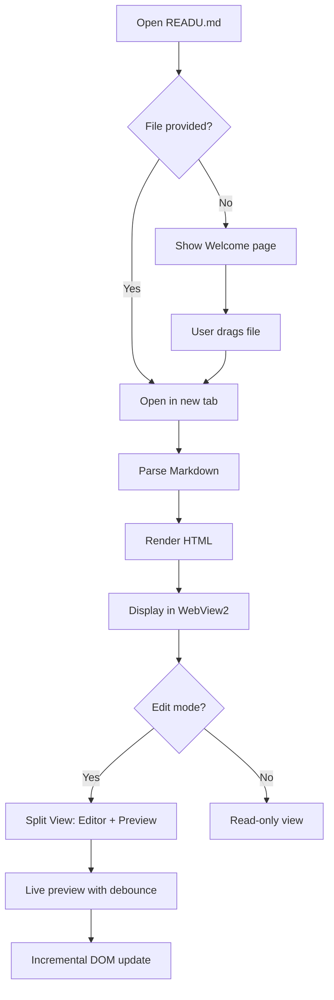
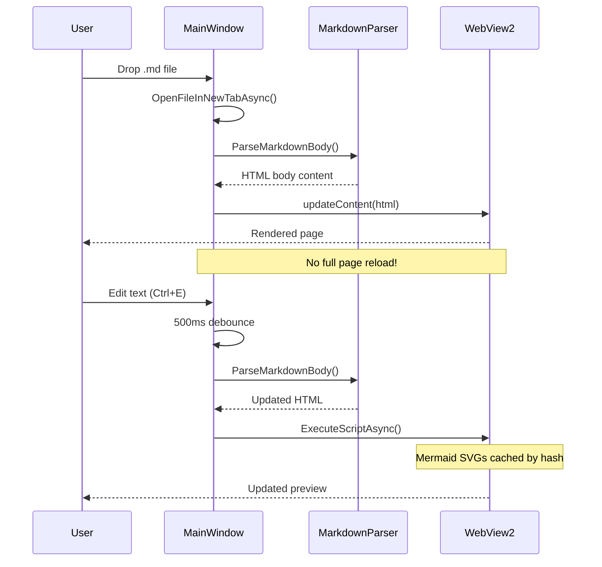
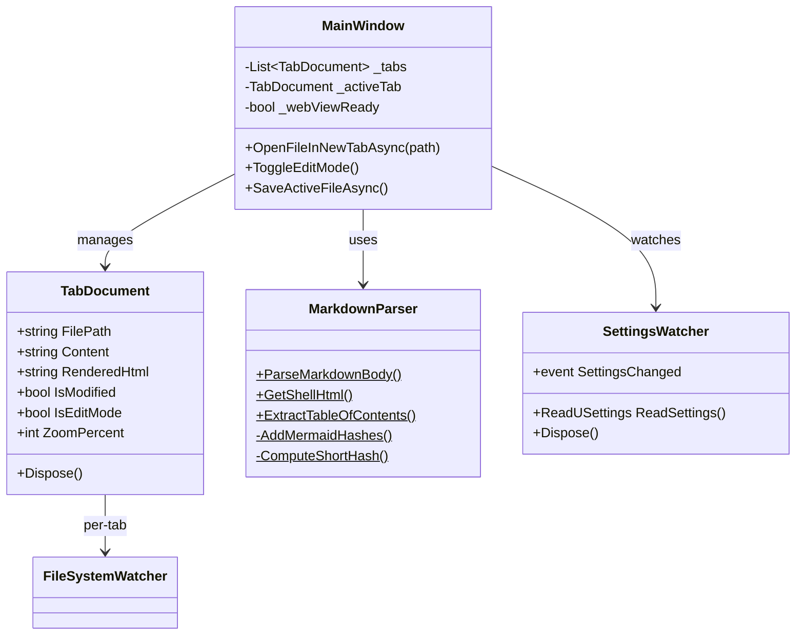
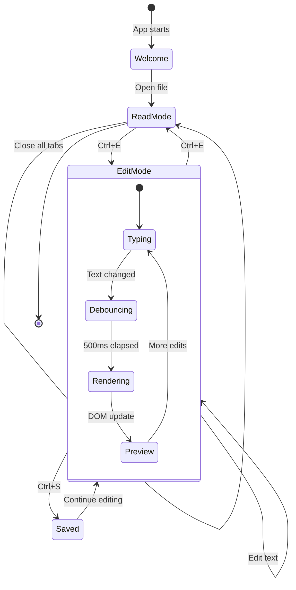
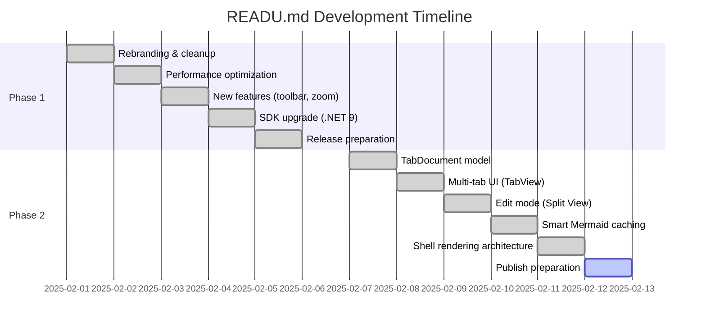
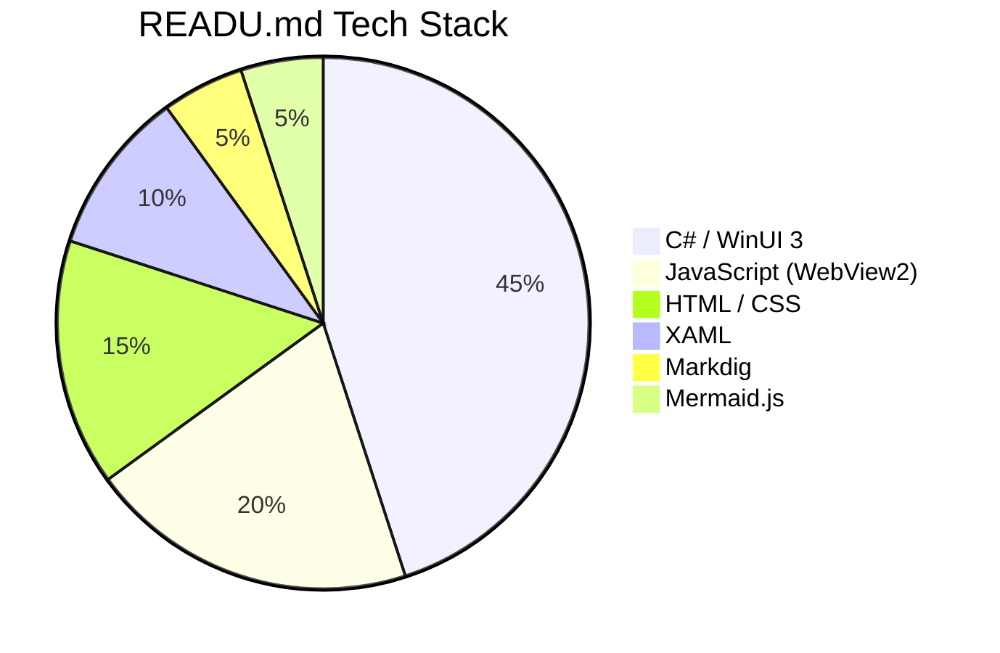
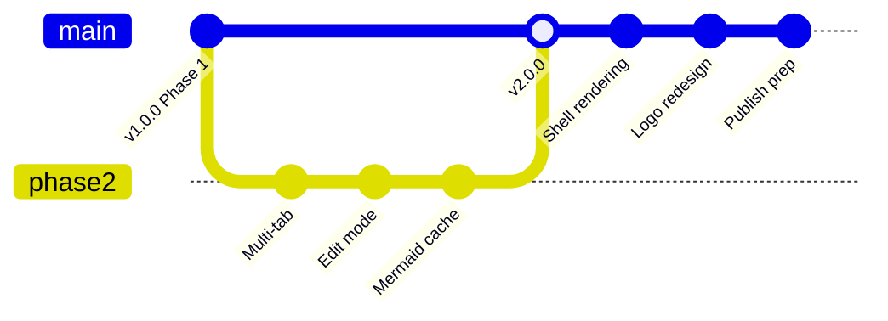

# Mermaid Diagrams

READU.md supports [Mermaid.js](https://mermaid.js.org/) for rendering diagrams directly from Markdown code blocks. Diagrams are **cached with SHA256 hashing** — unchanged diagrams won't re-render during live preview editing.

---

## Flowchart

---

## Sequence Diagram

---

## Class Diagram

---

## State Diagram

---

## Gantt Chart

---

## Pie Chart

---

## Git Graph

---

*All diagrams above are rendered live by Mermaid.js v11 with automatic dark theme support.*
