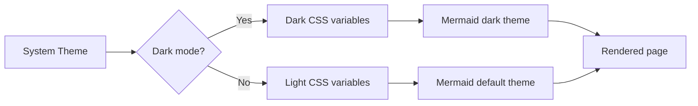

# Dark Mode & Theme Support

READU.md automatically detects your Windows system theme and applies matching styles — no configuration needed.

---

## How it works

The CSS uses `prefers-color-scheme` media queries:

```css
@media (prefers-color-scheme: dark) {
    :root {
        --text-color: #e6edf3;
        --bg-color: #0d1117;
        --code-bg: #161b22;
        --border-color: #30363d;
        --heading-color: #f0f6fc;
        --link-color: #58a6ff;
    }
}
```

Mermaid.js also switches to its `dark` theme automatically.

---

## Visual comparison

### Light mode elements
These elements adapt to both themes:

| Element | Light | Dark |
|---|---|---|
| Background | `#ffffff` | `#0d1117` |
| Text | `#24292f` | `#e6edf3` |
| Links | `#0969da` | `#58a6ff` |
| Code blocks | `#f6f8fa` | `#161b22` |
| Borders | `#d0d7de` | `#30363d` |

### Code block example
```typescript
interface Theme {
    name: 'light' | 'dark';
    background: string;
    foreground: string;
    accent: string;
}

const darkTheme: Theme = {
    name: 'dark',
    background: '#0d1117',
    foreground: '#e6edf3',
    accent: '#58a6ff',
};
```

### Blockquotes
> This blockquote adapts its border and text color to match the current theme.
> It uses CSS custom properties for seamless transitions.

### Mermaid in dark mode



---

## Try it!

1. Open **Windows Settings** → **Personalization** → **Colors**
2. Switch between **Light** and **Dark** mode
3. READU.md will update instantly — no restart needed

---

*READU.md — beautiful reading in any theme.*
